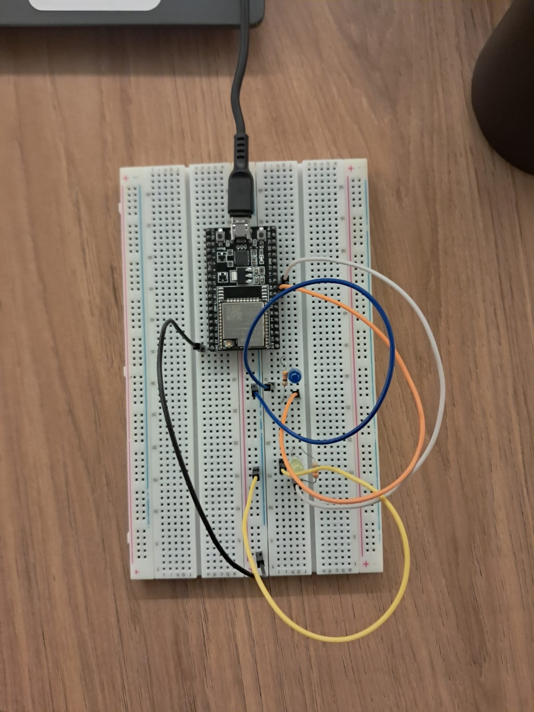

# Visão Geral sobre Segurança em IoT (Atividade Ponderada em Sala)


## Análise de vulnerabilidades do projeto: 

- **Criptografia**: o site utiliza HTTP ao invés de HTTPS, indicando a ausência de criptografia de dados para o usuário. Trecho de código em que isso aparece: 

```
WiFiServer server(80); //A porta 80 é padrão do HTTP.
```

Outro ponto a acrescentar é a falta da utilização da biblioteca que permite a utilização do protocolo HTTPS, que é a versão segura do protocolo de rede HTTP.	

- **Identificação dos pinos utilizados**: na página inicial é possível visualizar quais pinos estão sendo utilizados no ESP32. Trecho do código em que isso aparece:

```
// turns the GPIOs on and off
            if (header.indexOf("GET /26/on") >= 0) {
              Serial.println("GPIO 26 on");
              output26State = "on";
              digitalWrite(output26, HIGH);
            } else if (header.indexOf("GET /26/off") >= 0) {
              Serial.println("GPIO 26 off");
              output26State = "off";
              digitalWrite(output26, LOW);
            } else if (header.indexOf("GET /27/on") >= 0) {
              Serial.println("GPIO 27 on");
              output27State = "on";
              digitalWrite(output27, HIGH);
            } else if (header.indexOf("GET /27/off") >= 0) {
              Serial.println("GPIO 27 off");
              output27State = "off";
              digitalWrite(output27, LOW);
            }
```


- Ausência de autenticação: o site não conta com nenhum meio de autenticação, facilitando o acesso de terceiros não autorizados pelo sistemas.

## Tabela dos ataques identificados

| Título do Ataque              | Nível de Impacto (baixo, médio, alto) | Nível de Risco (baixo, médio, alto) |
|--------------------------------|-----------------------------------------|--------------------------------------|
| Comunicação não segura         | Alto impacto                           | Na situação em questão, o site utiliza apenas HTTP e não HTTPS (que possui a extensão TLS para criptografia de dados), por esse motivo não há segurança pela falta de criptografia proveniente do protocolo HTTPS. |
| Superfície de ataque ampliadas| Médio impacto                          | A exibição de pinos permite que o atacante entenda o hardware sem acesso físico, o que facilita o planejamento de ataques direcionados. |
| Autenticação fraca             | Alto impacto                           | O site em questão não conta com nenhum tipo de autenticação, logo é fácil ter acesso não autorizado ao sistema. |


## Projeto físico



